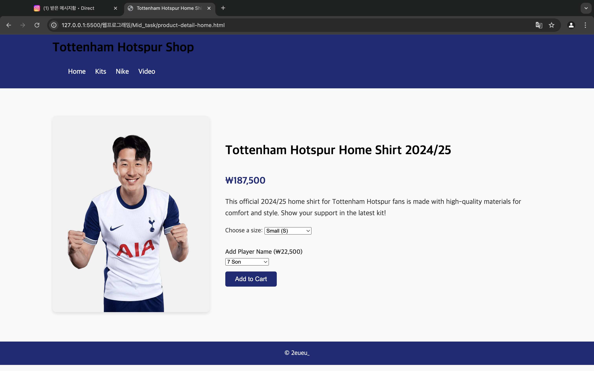

#  Tottenham Hotspur Shop Clone

>  **[Live Demo](https://2eueu.github.io/spurs-shop-clone/)**

A front-end web project that mimics the official Tottenham Hotspur online store.  
The site allows users to browse kits and Nike gear, search products, and select player name customizations before checkout.

---

##  Project Overview

-  **Goal**: Recreate a simplified e-commerce experience of the Tottenham Hotspur official shop  
-  **Features**: Product categories, video content, player name marking option, cart interaction  
-  **Timeline**: Created as a **midterm project** for a 2024 Web Programming course

---

##  Live Site

You can explore the full website here:  
 **[https://2eueu.github.io/spurs-shop-clone/](https://2eueu.github.io/spurs-shop-clone/)**

---

##  Project Plan (기획안)

- [ View PDF Proposal (WP1_2315726_이가은_기획안.pdf)](WP1_2315726_이가은_기획안.pdf.pdf)

---

##  Wireframes

| Homepage | Product Detail |
|----------|----------------|
|  |  |

---

##  Tech Stack

---

##  Pages Developed

### 1. Homepage
- Featured banner for quick access to new products
- Product category sections
- Embedded video for visual appeal

### 2. Product Detail Page
- Detailed item information
- Player marking selection
- `Add to Cart` functionality (static front-end)

---

##  Benchmark Reference

- [Tottenham Hotspur Official Shop](https://shop.tottenhamhotspur.com/)

---

##  About the Creator

-  **Name**: GaEun Lee (이가은)  
-  **Department**: AI Engineering, Sookmyung Women’s University  
-   Project Type: Front-End UI/UX + HTML/CSS/JS Practice  
-   GitHub: [@2eueu](https://github.com/2eueu)

---

## 📄 License

MIT License © 2024 GaEun Lee (2eueu_)
